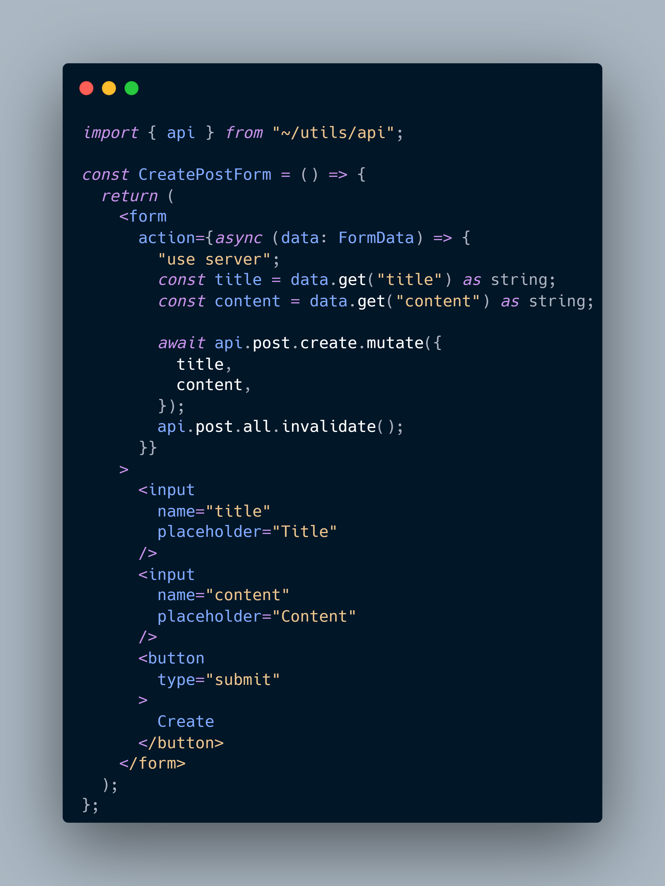

# TRPC Next.js 13 query invalidation experiment

## About

Just a little router experiment, testing query invalidation with revalidatePath and \_unstable_cache

## Credits

Built using [create-t3-turbo](https://github.com/t3-oss/create-t3-turbo).
